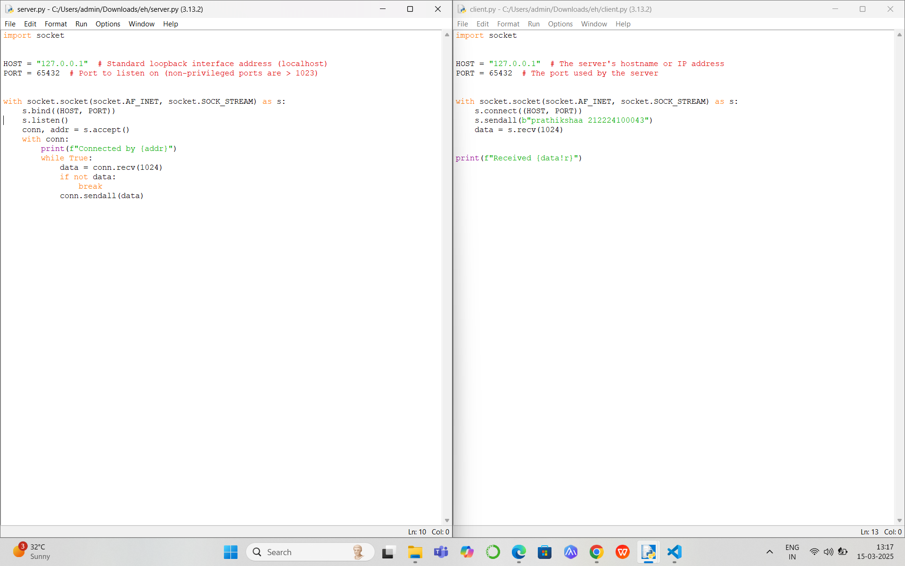
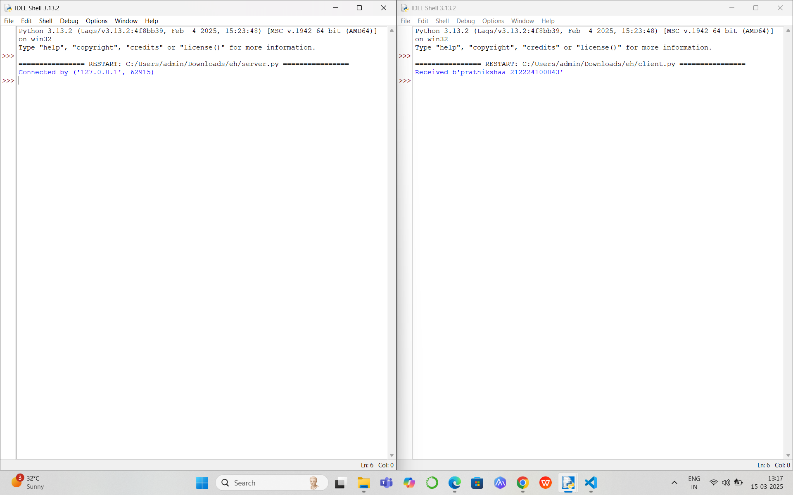

# EX1 - Echo server and client using python socket

# AIM:

To develop a simple webserver to serve html programming pages.

## DESIGN STEPS:

### Step 1:

Design of echo server and client using python socket

### Step 2:

Implementation using Python code

### Step 3:

Testing the server and client 

## PROGRAM:
import socket

HOST = "127.0.0.1"  # The server's hostname or IP address
PORT = 65432  # The port used by the server

with socket.socket(socket.AF_INET, socket.SOCK_STREAM) as s:
    s.connect((HOST, PORT))
    s.sendall(b"Hello, world")
    data = s.recv(1024)

print(f"Received {data!r}")

## OUTPUT:

## RESULT:
The program is executed successfully
